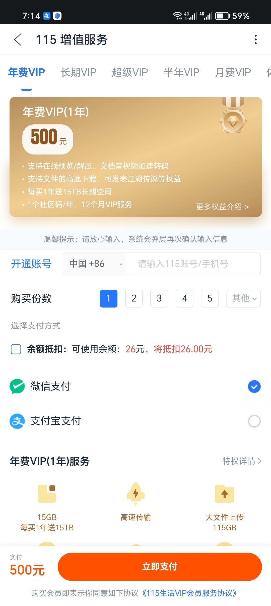
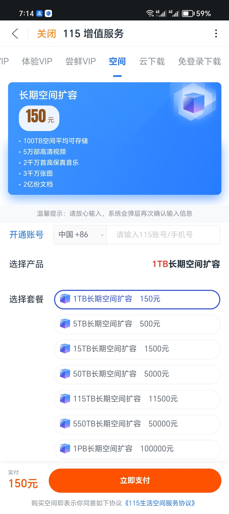
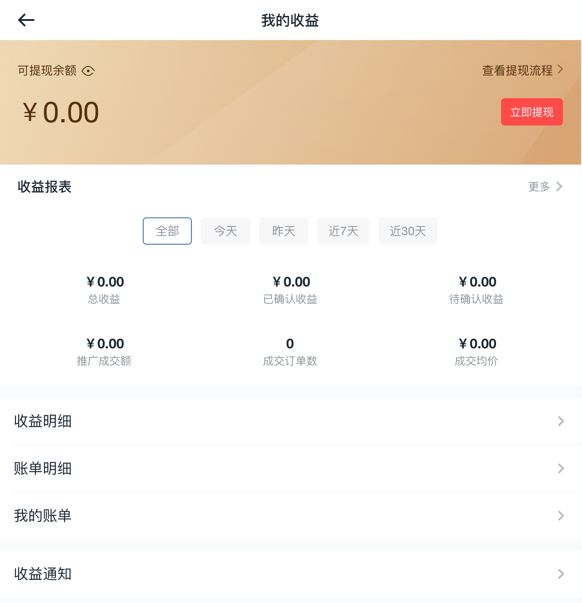

# 开发者商业价值转化：推广产品得收益

## 一、简介

为帮助开发者实现商业价值转化，并与平台共同构建可持续发展的生态体系，115 生活开放平台推出“推广产品得收益”计划。

在该计划下，开发者可以通过集成平台提供的标准化服务接口，在自己的应用场景中引导用户购买 115 增值服务，并基于用户的实际购买行为获得相应推广收益。

## 二、服务形式说明

### 1. 标准化服务接口

平台提供的标准化接口主要覆盖以下场景：

#### 1.1 VIP 服务

- 适用场景：用户对应功能使用权限不足时提醒。
- 功能支持：
  - 视频播放权限升级，例如非 VIP 用户无法在线预览视频、年费 VIP 以下用户无法进行 4K 超清转码等。
  - 大文件上传权限升级，例如月费 VIP 以下用户不支持上传 115GB 大文件。
- 解决方案：
  - 引导用户升级至更高等级的 VIP。

#### 1.2 长期存储空间扩容服务

- 适用场景：用户云存储空间不足时提醒。
- 功能支持：
  - 解决因空间容量不足导致的文件上传、复制及云下载添加失败等问题。
- 解决方案：
  - 引导用户购买 VIP 服务获得更多长期存储空间。
  - 支持单独购买长期存储空间扩容。

#### 1.3 云下载配额

- 适用场景：用户云下载配额不足时提醒。
- 功能支持：
  - 解决因服务配额不足导致的添加云下载失败等问题。
- 解决方案：
  - 引导用户升级至更高等级的 VIP 获取更多云下载配额。
  - 支持单独购买云下载配额。

### 2. 收益获取模式

当用户在开发者应用场景中被引导进入购买页面，并成功购买以下任一服务时，开发者即可获得对应推广收益：

- 115 生活 VIP 服务（包括月费 VIP、年费 VIP 等）
- 长期存储空间扩容
- 云下载配额




## 三、接入流程

### 1. 成为开发者

如果已经是 115 生活开发者，可以直接进入下一步。

未注册的开发者可参考[接入流程](https://www.yuque.com/115yun/open/fd7fidbgsritauxm)完成注册。

### 2. 接口接入

下方接口用于获取开放平台产品列表地址，开发者可在自己的应用场景中接入。

#### 获取产品列表地址

##### 基本信息

- Path：`GET 域名 + /open/vip/qr_url`
- Method：`GET`
- 接口描述：获取开放平台产品列表链接地址。

##### 请求参数

**Headers**

| 参数名称 | 参数值 | 是否必须 | 示例 |
| --- | --- | --- | --- |
| `Authorization` | `Bearer access_token` | 是 | `Bearer abcdefghijklmnopqrstuvwxyz` |

**Query**

| 参数名称 | 参数值 / 示例 | 是否必须 | 备注 |
| --- | --- | --- | --- |
| `default_product_id` | `1` | 否 | 打开产品列表时默认选中的产品 ID；如不传则使用默认排序。示例：月费 `5`、年费 `1`、尝鲜 1 天 `101`、长期 VIP（长期）`24072401` |
| `open_device` |  | 是 | 设备号 |
| `hide_title` | `0` | 否 | 是否隐藏购买页推荐人信息；`0` 不隐藏（默认），`1` 隐藏 |

##### 返回数据

| 字段 | 类型 | 备注 |
| --- | --- | --- |
| `state` | boolean | 接口状态；`true` 正常，`false` 异常 |
| `message` | string | 异常信息 |
| `code` | string | 异常码 |
| `data` | object | 数据 |
| `data.qrcode_url` | string | 开放平台产品列表地址 |

##### 返回示例

```json
{
  "state": true,
  "message": "",
  "code": "0",
  "data": {
    "qrcode_url": "https://example.com/qr/123"
  }
}
```

### 3. 场景触发与收益

接入成功后，以下场景可触发引导：

- 用户对应功能使用权限不足时，引导用户升级至更高等级的 VIP。
- 用户云存储空间不足时，引导用户购买 VIP 服务或单独购买空间扩容套餐。
- 用户云下载配额不足时，引导用户升级 VIP 或单独购买云下载配额。

当用户完成购买后，开发者即可获得对应推广收益。

## 四、收益管理与结算

### 1. 收益查看与提现

开发者可登录“115生活-生活-联盟”，或直接访问 [115联盟](https://union.115.com/)，查看收益明细、推广收益情况及提现入口。



### 2. 规则说明

收益计算方式、结算方式和提现流程等详情，可在 [联盟规则](https://union.115.com/?ac=help&i=10) 页面查看。

> 更新：2025-10-29 17:18:47
> 原文：[语雀链接](https://www.yuque.com/115yun/open/cguk6qshgapwg4qn)
