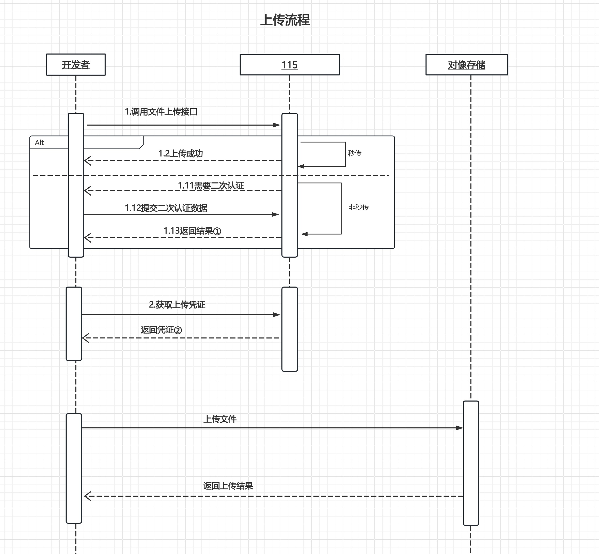

# 上传流程

## 流程说明

1. 先请求【文件上传】接口初始化上传任务。
   当接口返回 `status=2` 时表示秒传成功，上传结束；当返回 `status=1` 时表示非秒传，会返回预上传 `callback`。
2. 如果初始化上传时提示需要二次认证，则先完成二次认证；认证成功后再继续后续流程。
3. 对于非秒传场景，携带步骤 1 返回的 `callback` 以及其他参数，再结合【获取上传凭证】接口返回的数据，调用【对象存储】开始上传文件。
4. 断点续传场景下，携带步骤 1 返回的 `pick_code` 和待上传文件信息，请求【断点续传】接口，获取新的 `callback` 及其他参数，再结合上传凭证调用【对象存储】继续上传。
5. 当【对象存储】返回上传成功时，说明非秒传和断点续传文件都已上传完成。对象存储的具体调用方式可参考 [对象存储 API 文档](https://help.aliyun.com/zh/oss/user-guide/upload-objects-to-oss/?spm=a2c4g.11186623.help-menu-31815.d_4_3_1.2de91855mhgGG4)。

> 更新：2025-04-25 14:33:31
> 原文：[语雀链接](https://www.yuque.com/115yun/open/xb89onhdxsfpwsyc)
