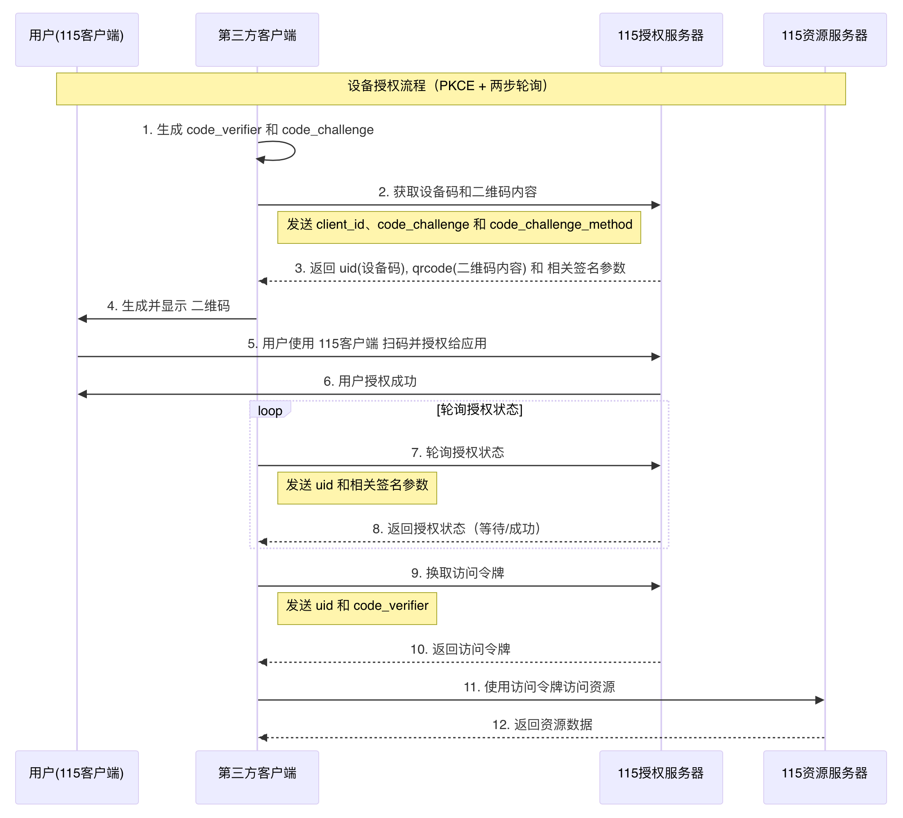

# 手机扫码授权 PKCE 模式

此模式适用于无后端服务的第三方客户端，使用 OAuth 2.0 + PKCE 完成授权，无需提供 `AppSecret`。



---

## 1. 获取设备码和二维码内容

使用接口返回的 `data.qrcode` 作为二维码内容，在第三方客户端展示二维码，供 115 客户端扫码授权。

### 基本信息

- 接口名称：设备码方式授权
- 请求方法：`POST`
- 接口地址：`https://passportapi.115.com/open/authDeviceCode`
- `Content-Type`：`application/x-www-form-urlencoded`

### 请求参数

| 参数名 | 类型 | 必填 | 示例 | 备注 |
|---|---|---|---|---|
| `client_id` | text | 是 |  | App ID |
| `code_challenge` | text | 是 | `THHodGWg-FZfv8XYz7QArNGIK_aVomSHPldlSOTUtkw` | PKCE 参数，计算方式见下 |
| `code_challenge_method` | text | 是 | `sha256` | 支持 `md5`、`sha1`、`sha256` |

`code_challenge` 计算方式：

```text
code_verifier = 43~128 位随机字符串
code_challenge = url_safe(base64_encode(sha256(code_verifier)))
```

注意：`sha256` 的输入结果需要使用二进制格式参与编码。

### 返回字段

| 字段 | 类型 | 说明 |
|---|---|---|
| `state` | number | 接口状态 |
| `code` | number | 错误码或状态码 |
| `message` | string | 返回消息 |
| `data.uid` | string | 设备码 |
| `data.time` | number | 校验时间戳，轮询状态时需要 |
| `data.qrcode` | string | 二维码内容 |
| `data.sign` | string | 校验签名，轮询状态时需要 |
| `error` | string | 错误信息 |
| `errno` | number | 错误码 |

---

## 2. 轮询二维码状态

这是长轮询接口。当二维码状态没有更新时，请求不会立即返回，而是等待状态变化或接口超时。

### 基本信息

- 接口名称：轮询二维码状态
- 请求方法：`GET`
- 接口地址：`https://qrcodeapi.115.com/get/status/`

### 请求参数

| 参数名 | 必填 | 备注 |
|---|---|---|
| `uid` | 是 | 从 `/open/authDeviceCode` 返回的 `data.uid` 获取 |
| `time` | 是 | 从 `/open/authDeviceCode` 返回的 `data.time` 获取 |
| `sign` | 是 | 从 `/open/authDeviceCode` 返回的 `data.sign` 获取 |

### 返回字段

| 字段 | 类型 | 说明 |
|---|---|---|
| `state` | number | `0` 表示二维码无效并结束轮询，`1` 表示继续轮询 |
| `code` | number | 状态码 |
| `message` | string | 返回消息 |
| `data.msg` | string | 操作提示 |
| `data.status` | number | 二维码状态；`1` 为扫码成功等待确认，`2` 为确认授权完成 |
| `data.version` | string | 版本信息 |

---

## 3. 用设备码换取 access_token

在二维码确认授权后，使用设备码和 `code_verifier` 换取 token。

### 基本信息

- 接口名称：用设备码换取 `access_token`
- 请求方法：`POST`
- 接口地址：`https://passportapi.115.com/open/deviceCodeToToken`
- `Content-Type`：`application/x-www-form-urlencoded`

### 请求参数

| 参数名 | 类型 | 必填 | 备注 |
|---|---|---|---|
| `uid` | text | 是 | 二维码 ID / 设备码 |
| `code_verifier` | text | 是 | 第一步计算 `code_challenge` 时使用的原始值 |

### 返回字段

| 字段 | 类型 | 说明 |
|---|---|---|
| `state` | number | 接口状态 |
| `code` | number | 错误码或状态码 |
| `message` | string | 返回消息 |
| `data.access_token` | string | 访问资源接口时使用的凭证 |
| `data.refresh_token` | string | 用于刷新 `access_token`，有效期 1 年 |
| `data.expires_in` | number | `access_token` 有效期，单位秒 |
| `error` | string | 错误信息 |
| `errno` | number | 错误码 |

---

## 更新记录

| 更新时间 | 更新内容 |
|---|---|
| 2025-04-07 | `/open/authDeviceCode` 的 `code_challenge` 参数兼容调整，兼容 URL safe |

> 更新：2025-04-08 15:35:14
> 原文：[语雀链接](https://www.yuque.com/115yun/open/shtpzfhewv5nag11)
