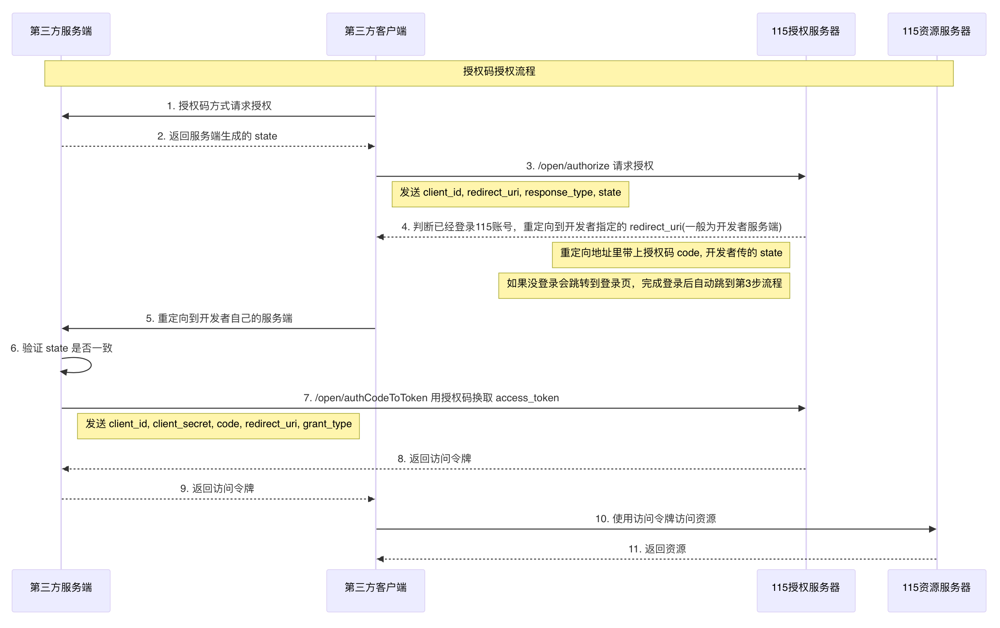

# 授权码模式

本模式建议由开发者服务端参与授权流程。

基础域名：

- [https://passportapi.115.com](https://passportapi.115.com)

## 1. 授权码方式请求授权

### 基本信息

- Path：`/open/authorize`
- Method：`GET`
- 接口描述：用户未登录时会重定向到登录页面；已登录时会自动完成授权，并重定向到 `redirect_uri` 指定地址。

### 请求参数

**Query**

| 参数名称 | 是否必须 | 示例 | 备注 |
| --- | --- | --- | --- |
| `client_id` | 是 |  | App ID |
| `redirect_uri` | 是 | `https://foo.com/bar` | 授权成功后会重定向到该地址，并附带授权码 `code`；如果传入 `state`，也会一并回传。该地址域名需先在开放平台应用管理中配置。 |
| `response_type` | 是 | `code` | 固定值 `code`，表示授权码模式。 |
| `state` | 否 | `123456` | 随机值，会通过 `redirect_uri` 原样返回，建议用于防 CSRF 校验。 |

### 返回数据

以下内容仅在接口调用失败时返回：

| 名称 | 类型 | 是否必须 | 默认值 | 备注 | 其他信息 |
| --- | --- | --- | --- | --- | --- |
| `state` | number | 非必须 |  | `0` 失败，`1` 成功 |  |
| `code` | number | 非必须 |  |  |  |
| `errno` | number | 非必须 |  |  |  |
| `data` | object | 非必须 |  |  |  |
| `message` | string | 非必须 |  |  |  |
| `error` | string | 非必须 |  |  |  |

## 2. 用授权码换取 access_token

### 基本信息

- Path：`/open/authCodeToToken`
- Method：`POST`
- 接口描述：强烈建议在服务端请求此接口，避免 `App Secret` 泄露。

### 请求参数

**Headers**

| 参数名称 | 参数值 | 是否必须 | 示例 | 备注 |
| --- | --- | --- | --- | --- |
| `Content-Type` | `application/x-www-form-urlencoded` | 是 |  |  |

**Body**

| 参数名称 | 参数类型 | 是否必须 | 示例 | 备注 |
| --- | --- | --- | --- | --- |
| `client_id` | text | 是 |  | App ID |
| `client_secret` | text | 是 |  | App Secret |
| `code` | text | 是 |  | 授权码，即重定向地址中返回的 `code` |
| `redirect_uri` | text | 是 | `https://foo.com?state=123456` | 必须与前一步请求时的 `redirect_uri` 一致，用于防 MITM / CSRF。 |
| `grant_type` | text | 是 | `authorization_code` | 固定值 `authorization_code`，表示授权码模式。 |

### 返回数据

| 名称 | 类型 | 是否必须 | 默认值 | 备注 | 其他信息 |
| --- | --- | --- | --- | --- | --- |
| `state` | number | 非必须 |  | `0` 失败，`1` 成功 |  |
| `code` | number | 非必须 |  |  |  |
| `message` | string | 非必须 |  |  |  |
| `data` | object | 非必须 |  |  |  |
| `data.access_token` | string | 非必须 |  | 用于访问资源接口的凭证 |  |
| `data.refresh_token` | string | 非必须 |  | 用于刷新 `access_token`，有效期 1 年 |  |
| `data.expires_in` | number | 非必须 |  | `access_token` 有效期，单位秒 | mock: `7200` |
| `error` | string | 非必须 |  |  |  |
| `errno` | number | 非必须 |  |  |  |

> 更新：2025-04-03 13:50:56
> 原文：[语雀链接](https://www.yuque.com/115yun/open/okr2cq0wywelscpe)
